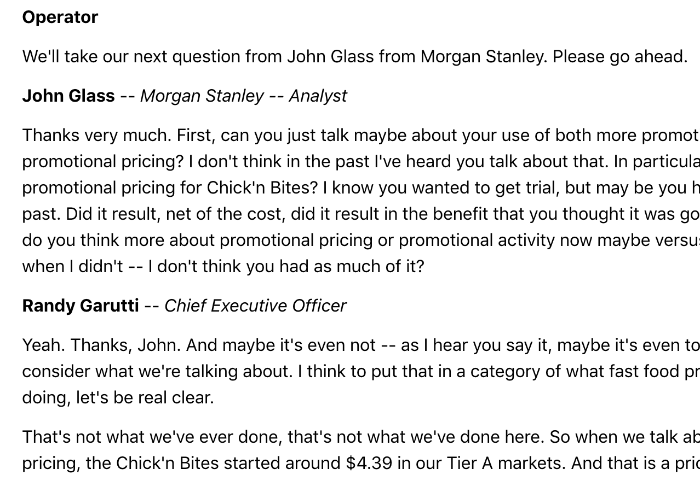

## **NLP Modeling of Corporate Earnings Calls**
Updated on 9/30/19

---

## Summary  
The objective of this project is to model topics for corporate earnings calls and search for patterns in underperforming and outperforming companies.  I modelled the topics for analyst questions and a seperate set of topics for company responses.  I built a tableau dashboard to review 1) the topics discussed in a given call, and 2) the differences in question topics vs answer topics.

---

## Background
Public companies are required to release updated financial documents at the end of each quarter.  Companies typically hold a conference call with investors when the financial documents are released or shortly after.  This allows the company to address unexpected results or put better context around sensitive topics.

Earnings call typically follow a regular pattern.  First, one to three chief executives make a prepared statement about the previous quarter and future outlook.  It is not uncommon for CEO's, CFO's, or other significan leaders in the company to deliver these remarks.  

Following the remarks, the call is openned up for questions.  Analysts from major investors (typically large banks or asset managers like JP Morgan, Goldman Sachs, Morgan Stanley, etc).  Questions are not provided in advance and chief executives need to answer on the spot.  Questions can cover a wide range of topics such as the financial results, upcoming products, legal issues, leadership changes, etc.

---

## Data Collection 

### Part 1:  Call Transcripts

The transcripts from earnings calls were collected from  the website `The Motley Fool`.  Motley Fool posts earning call transcripts for most major companies going back to Q4 2017 ([link](https://www.fool.com/earnings-call-transcripts/)).  The structure of the transcripts have one major curveball, the names of the speakers are inline with the text (see below).

To collect all the transcripts, first I scrapped all the url's of all earnings calls.  This was nececery because the url's did not follow a standard format.  Next, I loaded each url and saved the transcript text for each page.  I saved each transcript as a dictionary, where the key was the speaker and the value was the text.  This helped manage the issues for parsing the speaker from the text.  I also save the time and date of the call, which will be used to calculate company performance.

### Part 2:  Price History and Sector

To determine if a company is outperforming or underperforming, I am looking at the movement of stock price before and after the earnings call.  The historical price data can be easily collected from `Quandl`, a website that offers access to financial data via APIs.  from Quandl I can 

## Pre-Processing

## Modeling

## Results