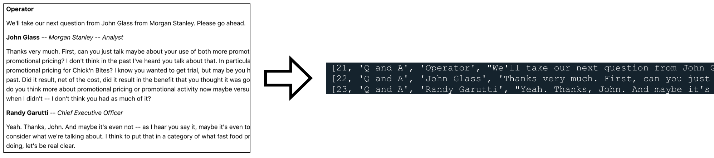

## **NLP Modeling of Corporate Earnings Calls**
Updated on 9/30/19

---

## Summary  
The objective of this project is to model topics for corporate earnings calls and search for patterns in underperforming and outperforming companies.  I modelled the topics for analyst questions and a seperate set of topics for company responses.  I built a tableau dashboard to review 1) the topics discussed in a given call, and 2) the differences in question topics vs answer topics.

---

## Background
Public companies are required to release updated financial documents at the end of each quarter.  Companies typically hold a conference call with investors when the financial documents are released or shortly after.  This allows the company to address unexpected results or put better context around sensitive topics.

Earnings call typically follow a regular pattern.  First, one to three chief executives make a prepared statement about the previous quarter and future outlook.  It is not uncommon for CEO's, CFO's, or other significan leaders in the company to deliver these remarks.  

Following the remarks, the call is openned up for questions.  Analysts from major investors (typically large banks or asset managers like JP Morgan, Goldman Sachs, Morgan Stanley, etc).  Questions are not provided in advance and chief executives need to answer on the spot.  Questions can cover a wide range of topics such as the financial results, upcoming products, legal issues, leadership changes, etc.

---

## Data Collection 

There are 3 data sources for this project:
 1. **The Motley Fool:** Earnings call date, time, and text transcripts 
 2. **Yahoo Finance:**  S&P 500 historical prices and stock correlations 
 3. **Quandl:** Company price history and company sector
 
 
### <u>The Motley Fool</u>

The transcripts from earnings calls were collected from  the website `The Motley Fool`.  Motley Fool posts earning call transcripts for most major companies going back to Q4 2017 ([link](https://www.fool.com/earnings-call-transcripts/)).  The structure of the transcripts have one major curveball, the names of the speakers are inline with the text.

To collect all the transcripts, first I scrapped all the url's of all earnings calls.  This was nececery because the url's did not follow a standard format.  Next, I loaded each url and saved the transcript text for each page.  I saved each transcript as a list of lists, each list representing a given speaker and text, along with an ID number and which section of the call it occured (Prepared Remarks or Q&A).  This was done with some regex and html parsing.  I also save additional data from each call such as the time and date of the call along with the company stock ticker.

### <u>Yahoo Finance</u>

Using stock prices to identify if a company outperforms can be misleading if the overall market is not accounted for.  For example, if company A's stock rose by 1% following a call but the overall market rose by 2%, it looks like company A actually underperformed.  To account for this, I will use the S&P 500 as a proxy for the broad market.  From `Yahoo Finance` I was able to collect historical daily open, high, low, and close prices for the S&P 500 for all days in our analysis.  This was simple to download as a single csv file from the S&P 500 page on Yahoo Finance.

The other component of compairing a company to the broad market is how correlated the company is to the broad market.  For example, if company A rose by 1.2%, the broad market rose by 1%, and company A has a historical correlation to the market of 1.5, this could be seen as underperformance (the 1.5 correlation implied that if the market rose by 1%, company A should rise by 1.5%).  The market correlation is typically referred to as "beta" and `Yahoo Finance` publishes the 3 month rolling beta for each company.  Using BeautifulSoup I was able to scrape all betas for companies included in the analysis.

### <u>Quandl</u>  
**NOTE:**  Must install the quandl python library and register for a quandl API key.

To determine if a company is outperforming or underperforming, I am looking at the movement of stock price before and after the earnings call.  The historical price data can be easily collected from `Quandl`, a website that offers access to financial data via APIs.  Through Quandl I pulled down historical daily open, high, low, and close prices for each day going back to my earliest eaning call.  Included in the Quandl dataset was the sector of the company, which was saved and incorporated as well.

---

## Modeling

## Results